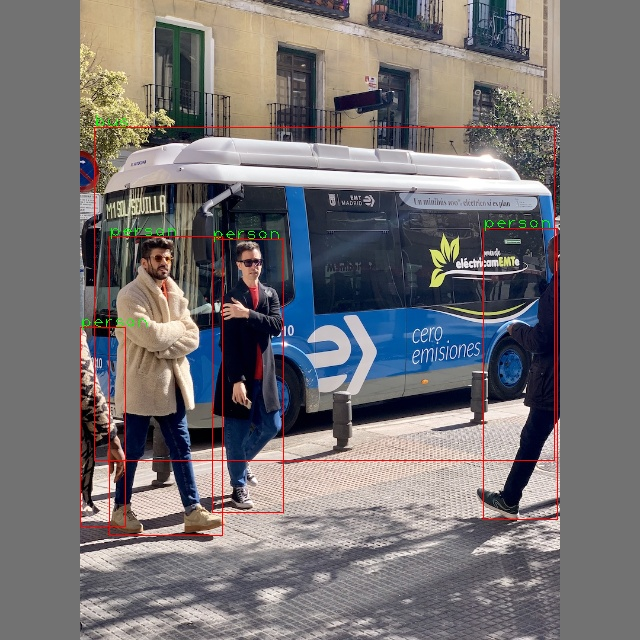

## 介绍

使用libtorch部署yolov3模型，由于c++没有torchvision,只能使用OpenCV处理图像，所以最好模型训练时同样是使用OpenCV进行图像处理。这里挑选 [YOLOv3_Pytorch](https://github.com/BobLiu20/YOLOv3_PyTorch)提供的预训练模型。

## 环境准备

1. 需要下载libtorch,解压放在工程目录下
2. GCC需要支持C++17标准

## 模型导出

我们需要拿到YOLOV3_Pytorch的预训练模型，然后使用`trace.py`转换成`jit trace module`. 

1. 克隆YOLOv3_Pytorch代码:
```bash
git clone https://github.com/BobLiu20/YOLOv3_PyTorch.git
cd YOLOv3_PyToch
```
2. 从谷歌云盘下载Pytorch预训练模型 ： [Google Drive](https://drive.google.com/file/d/1SnFAlSvsx37J7MDNs3WWLgeKY0iknikP/view?usp=sharing) \\ [Baidu Drive](https://pan.baidu.com/s/1YCcRLPWPNhsQfn5f8bs_0g)  
3. 将下载的模型重命名，然后移动到对应目录:

```powershell
mkdir weights
mv official_yolov3_weights_pytorch.pth weights/yolov3.pt
```
4. 模型转换:
```powershell
cp trace.py .
python3 trace.py
```
最终我们会得到一个名为`model.pt`的`jit`模型

## 运行
克隆代码 复制模型,然后进行构建

```bash
git clone https://github.com/Hexmagic/libtorch_example.git
cd libtorch_example
mkdir weights
cp model.pt weights
```
编译代码:
```bash
mkdir build&&cd build 
cmake ..
make -j4 
cp main ..
./main
```
